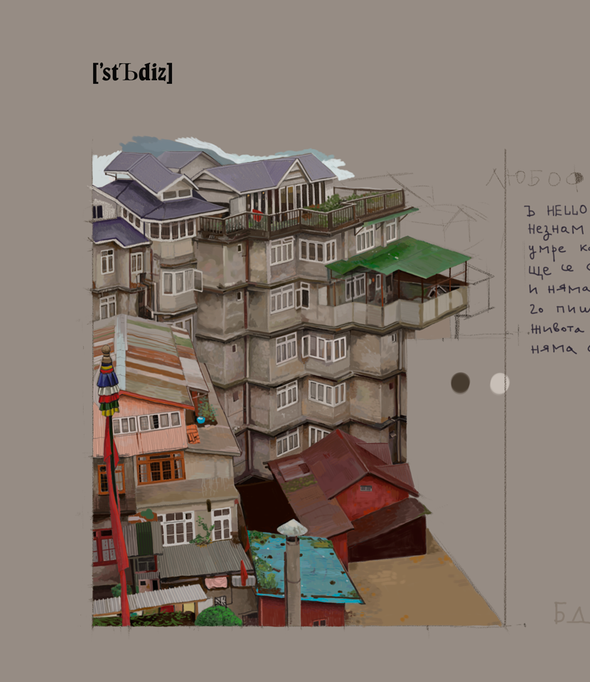

# ŖÑĎ*Ձ*, ԹЯOB*1*
## RND2, PROB1
### RND2, PROB1
#### RND2, PROB1
##### RND2, PROB1
***Ok!*** this is rnd *2* prob *1*, and it's "bout *Guard Shedule* and an *Art Gallery*.
£irst æe ¦ave ±o ¶ocate ×he Þeriods ¾ith *Ø* ór *¹* Çuards ¡n ¬he *§hedule*.
TĦen sűpplied wĩth *Gąllery's* cĹosing tİme aʼnd **dūty length** pěr gŲard,
tħe pŕogram hăs tő cŐver tĤose *gĄps* wīth mınimum pŌssible ***wĀtchmen*** >**>**
 [cłck](https://ioinformatics.org/files/ioi1990round2.pdf "IOI'90, Round 2").

### *:ːartǦallery,̀ part 1̋*


*Ɯathƺmatically* iƮ'ƽ Ɛaƨy ƫǫ ƋssƎrt Ƭǂe ƾolǚtion ǁƞ tǝƦms Ǒƒ oƿƏratiǭns Ǫɳ ***Ʒeƭs***:
ɪɟ ***ℐ <sup>j</sup>*** ɩʂ *ʝʈƕ* ʍɐtʗhman ɖuʇʏ, ɑɴɖ *℥* ɨś ʈh̷e̎ ɔʟʘsing ʇɪmҾ,
̅ћαƝ tϦe Ƨĕt oϝ tiɯ**Ξ** ʅ̊ntervals̅ **ϒ**ithout פu**a̲**rds **i**Ƽ:
*[ 0, **℥** ]* \\*⋓<sub>j</sub> **ℐ** <sup>j</sup>*. φe ςѦn uʒe ***Пython*** sҼtՏ,
ԳuԵ w६ Իave Ϯo w०rk␣Ҩ*ⓘ┯Ҥ* ***ρ***ℜ℮∂e℉⌇ne**d** Ի*esoʅution* Δt,
aℵd **ℸ**han **Ŗ**epresenting giÝen tiഈe ำnterval *(ಠ , b)* aՖ ɐ̥ **Ғ**ฯnite ░et of
*(ϐ - a) / Δt* elϱments. Եhe otԽer appՒoach, նsed ϳn thίs p२ogram, iೡ  ʈo ɖo eƔerything
þy ɦand. There are *6* different relations betveen *2* time intervals:
```Python
from enum import Enum
################################################################
class Type(Enum): #                                            _
    dl = 1 # disjoint left : --(----)---a---------b----------- _
    dr = 2 # disjoint right: -----------a---------b---(----)-- _
    sp = 3 # superset      : -----------a--(---)--b----------- _
    sb = 4 # subset        : --------(--a---------b--)-------- _
    xl = 5 # cross left    : --------(--a--)------b----------- _
    xr = 6 # cross right   : -----------a------(--b--)-------- _
################################################################
```
Zo accordingly to the above cases we can loop over Guard Shedule and split the
initial Gallery's working time into sub-intervals each one having different number of
guards. For example if *end_time* is *10* and *Guard Shedule* is 
[ [*1*, *4*], [*3*, *5*], [*6*, *9*] ], than the initial [ [*0*, *10*]: ***0*** ]
list is split to
*[
[0, 1]: ***0***,
[1, 3]: ***1***,
[3, 4]: ***2***, 
[4, 5]: ***1***,
[5, 6]: ***0***, 
[6, 9]: ***1***, 
[9, 10]: ***0***
]*,
ver the number after the colons is the nof guards for that period. It's possible as a
result to get adjacent periods with same *nof guards* zo in addition we perform a
concatenation operation on such periods. In the program this is done by the
functions *classify* and *cat (aka con)*. To get the desired list ve hafe to cover
(undercova) we finally filter those entries with nof guards less than *2*.
Here is an example dump of the program up to that point:
```
artGallery (OPEN/CLOSE): (0, 10)
Guard Shedule:
  0  ,  3
  2  ,  4
  1  , 5.2
  4  ,  6
  7  , 10
After classify:
  0  ,  1  :1
  1  ,  2  :2
  2  ,  3  :3
  3  ,  4  :2
  4  , 5.2 :2
 5.2 ,  6  :1
  6  ,  7  :0
  7  , 10  :1
After cat(aka con):
  0  ,  1  :1
  1  ,  2  :2
  2  ,  3  :3
  3  , 5.2 :2
 5.2 ,  6  :1
  6  ,  7  :0
  7  , 10  :1
Undercova:
  0  ,  1  :1
 5.2 ,  6  :1
  6  ,  7  :0
  7  , 10  :1
```
### *artGallery, part 2 ( .. u6a-a-a oTge ru 3e'Tu Tus cuHu Tpt6u 6e ge6a !? )*


**YEAh** Ok **PARt** tWO **thiS** iS **thE** COVERiNG **PARt**, **W**E RE**f**ER th**E** **S**O ***C***AllEd l**E**NGth
i**N** **Z**E tE**X**t A**Z** *patch_size* O**R** *psiz*. AlZ**O** W**E** **R**EfER t**O** th**E** UNdERCOVA **l**iSt A**Z**
***ARChiPElAGO*** **f**OR th**E** fOllO**W**iNG **R**EASON: i**f** **Z**E di**S**tANCE bEtWE**E**N ENd**P**OiNtS **O**f *2* ti**M**E
iNtER**V**AlS i**S** biG**G**ER thA**N** *psiz*, W**E** **C**AN **C**OVER thE**M** **i**NdEPENdENtlY f**R**OM EA**C**h **O**thER lik**E**
**S**tEfAN-**b**OltZMANN. Z**O** **W**E SPli**t** **Z**E ***ARChiPElAGO*** iN**t**O *i**S**lANdS*, **S**UCh th**A**t Al**l** **N**EiGhbOR
*iNtERVA**l**S* A**R**E Whiti**N** **A** *patch_size*'***s*** **R**AdAR.

Let's consider a case with an island with just *2* periods, than the number of patches needed to cover the island
depends on how we consider different periods, as a group or as separate units:
```
0         1         2
012345678901234567890

-----,,,,,-----`````  - patches
********    ****      - Island's periods
a) we need 4 patches to cover ze periods as a group
            
-----`````  -----
********    ****
b) we need 3 patches to cova same periods independently  
   
In the next example we have the reversed scenario:

0         1         2
012345678901234567890

-----`````,,,,,       - patches
=======  ======       - periods
a) group: 3 patches
            
-----`````
=======  ======
         -----*****
b) separate: 4 patches
```
Zo for example in the case of three periods we have to consider *4* scenarios:
```
-0-(abc)-------one-group----
*1*(a)(bc)*****two*groups***
*2*(ab)(c)****************** 
=3=(a)(b)(c)===dree=groups==
```
For the general case of n periods we can proceed as follows:)
Let *k* denotes ze number of groups, zen we can consider ze *n - 1* positions
betveen ze periods, and if ve place *k - 1* parenthesis **)(** in those slots, 
than we'll have one partition of *k* groupz. To get ze all scenarios we have to 
generate all **C<sup>n-1</sup><sub>k-1</sub>** combinations.
For example if *n=5* and *k=3* we have the following picture:
```
0) (abcde) - a list of 5 periods
1) first we put ze 4 slots:
   (a . b . c . d . e)
      1   2   3   4
2) than, we put ze )('s at all possible 6 combos of ze slots:
   (a )(b )(c . d . e) - {1,2}: (a)(b)(cde)
   (a )(b . c )(d . e) - {1,3}: (a)(bc)(de)
   (a )(b . c . d )(e) - {1,4}: (a)(bcd)(e)
   (a . b )(c )(d . e) - {2,3}: (ab)(c)(de)
   (a . b )(c . d )(e) - {2,4}: (ab)(cd)(e)
   (a . b . c )(d )(e) - {3,4}: (abc)(d)(e)
```
Up to this point we regarded ze underlying periods uniformly, but they have different
weights so to speek coz they are either *0* or *1* guard periods, and ve might get
different results if ve start covering ze intervals from ze left or from ze right end.
For example:
```
= - 0 guards
* - 1 guard
Patch size is 6 ' ' units

| ' ' ' ' ' | ' ' ' ' ' | ' ' ' ' ' | ' ' ' ' ' | ' '
' ' ' ' ' ' '='='='='='='='='='=' ' '*'*' ' ' ' ' ' '
a)   Here we need 2 + 2 + 1 = 5 guards (left align)

' ' | ' ' ' ' ' | ' ' ' ' ' | ' ' ' ' ' | ' ' ' ' ' |
' ' ' ' ' ' '='='='='='='='='='=' ' '*'*' ' ' ' ' ' '
b)   In rigth alignment ve need 3 * 2 = 6 guards

```
,zo it becomes a little bit complex, coz of that;: to figure all scenarios we need
**four** for loops:). Here is the remaining dump of ze program:
```
Island 0
  0  ,  1  :1
2 extra guards needed
Starting from 0: [1, 1]
Island 1
 5.2 ,  6  :1
  6  ,  7  :0
  7  , 10  :1
12 extra guards needed
Starting from 5.0: [1, 1, 2, 2, 1, 1, 1, 1, 1, 1]
```



